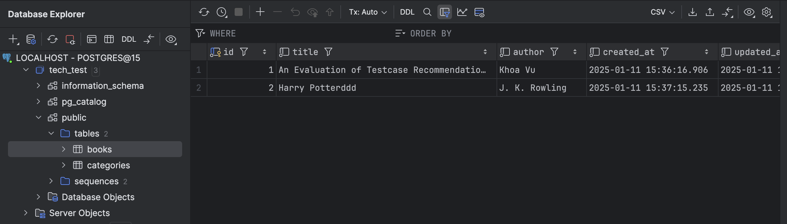
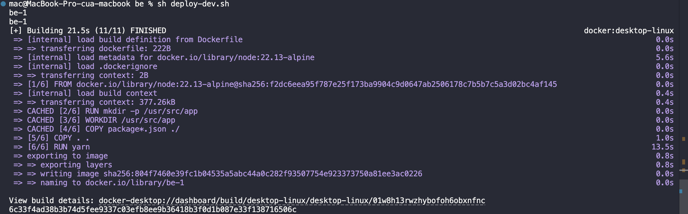
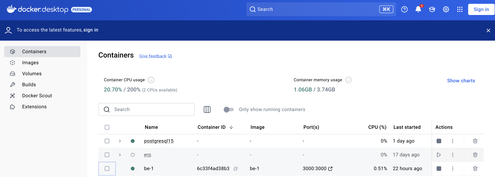

# A Crude Server

### Setup
#### Database
- Make sure the Docker desktop has been installed, else follow [youtube](https://docs.docker.com/engine/install/)
- In Windows, make sure you can run .sh script. If not, follow [stackoverflow](https://stackoverflow.com/questions/26522789/how-to-run-sh-on-windows-command-prompt). In MacOS or Linux, don't care about it.
- Ịn /db, run the command:
```
    sh start-postgres.sh
```
This will create postgreSQL database container with the setup information in docker-compose.yml

#### Backend
Go to the folder /be

In development mode, we can run by follow this instruction bellow:
1. install yarn from npm: [yarn](https://classic.yarnpkg.com/lang/en/docs/install/#mac-stable)
2. Run command:
```
    yarn
```
This will add /node_modules to the source codes.
3. Continue to run command:
```
    yarn prisma generate
```
This will generate configuration of the db schema in /prisma
4. Run command
```
    yarn prisma push
```
This will push the db configuration schema to postgreSQL db (the database structures)
For example, the db structures look like this:

5. Run command
```
    yarn dev
```
This will run the backend server

*Notes: Be carefully to adjust the db host in /src/config because the db we has septup is in the docker network (change the host to localhost)

In production mode, we can use docker to run container (the docker setup has been discussed in the Database setup). So simplify, run command:
```
sh deploy-dev.sh
```
This will create be container. 

We can see both db container and be container in docker desktop:


We can test with the postman collection in folder /postman

### Backend Structrures
I structure the backend by following feature - based structures (similar to the Domain-Driven Design)
```
/prisma
/scripts -> for common script command, sql scripts, etc...
/src
    /config
        default.ts
    /middlewares
        ...
    /modules
        /books
            /controllers
            /services
            /routers
            /dto
            ...
        /categories
        ...
    /services -> the common services
    /utils
    app.ts
    package.json
    tsconfig.json
    yarn.lock
```

### Points to improve:
- Implement middlewares for validate request Query/Body.
- Implement docker-compose file for be to deploy be and db sub-container in one container (currently, I split them into 2 container that use the same network).
