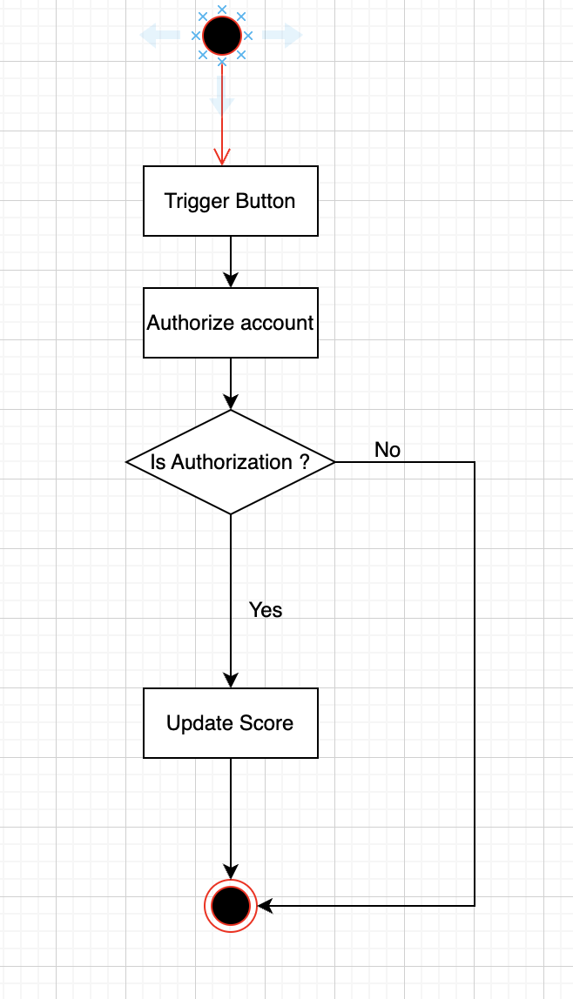

# Score Board Module

This module is responsible for managing the scoreboard of users' scores on the website. It provides endpoints to update user scores upon completion of specific actions and to retrieve the top 10 user scores for display. The module also ensures that score updates are secure and validated to prevent unauthorized score modifications.

### Requirements

##### Functional Requirements
- Users can increase their scores by clicking button.
- The web page can fetch the top 10 user scores for display on the website.
##### Non-functional Requirements
- Live Scoreboard Updates: The API will support real-time updates to the scoreboard.
- Authorized actions will be acted (JWT) when users update score board.

### Flow of Execution
1. User completes an action, triggering an API call to update their score.
2. The API validates the user's authToken and checks the action's legitimacy.
3. If valid, the API updates the user's score in the database.
4. The updated score is then broadcasted to all connected clients for real-time scoreboard updates.
- Diagram:


### API EndPoints

1. Update Score:
    - POST /api/scores/update
    - Description: Updates the score of a user after completing an action.
    - Request Body
    ```
    {
        "scoreIncrement": "number",
    }
    ```
    - Response: 200 - OK
    ```
    {
        "success": true,
        "message": "Score updated successfully."
    }
    - Response: 401 - Unauthorized
    {
        "success": false,
        "message": "UNAUTHORIZED"
    }
    ```
2. List Scores:
    - GET /api/scores
    - Description: Retrieves the top users' scores.
    - Query Params:
    ```
    {
        isRealTime: boolean,
        pageSize: number,
        pageNumber: number,
    }
    ```
    - Response:
    ```
    [
        {
            "userId": "string",
            "score": "number"
        },
        ...
    ]   
    ```

### Implementation Details
- Database: Use a relational database to store user scores and actions.
- Authentication: Implement JWT to validate users.
- Real-Time Updates: Use WebSocket for live updates to the scoreboard.
- Rate Limiting: Use Redis cache to save user action (userId, timestamp of action). When BE side receive the request from FE, they will get user cache timestamp to check, if passed, then we update score in relational database.
